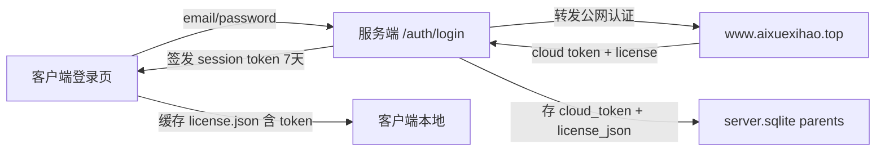
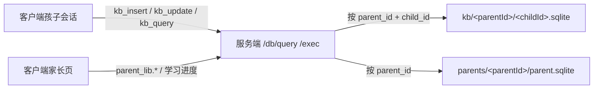
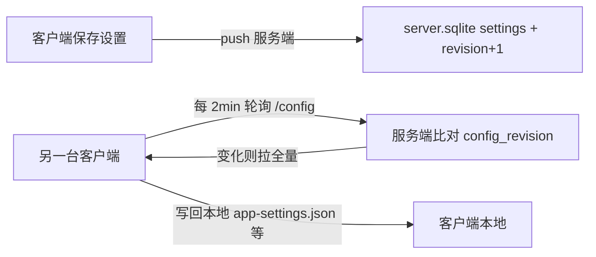
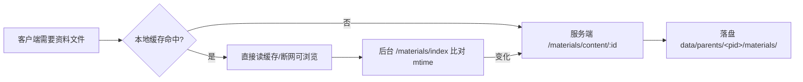

# 服务端数据结构（SPLIT 架构）

> 版本：2026-08-27 · 对应 `server/`（端口 8788，数据根 `server/data/`）
> 本文件描述新架构（客户端 + 服务端拆分）下**服务端**的数据组织：目录布局、数据库表结构、字段用途与数据流。
> 客户端侧仅剩缓存（`data/parents/<pid>/materials/` 资料缓存、`data/cache/` 版本标记、`server-connection.json` 连接配置、会话 jsonl），不持有业务数据库。

---

## 1. 架构定位

- **服务端是数据唯一真源**：家长账户、孩子名册、教学知识库、学习记录、学习资料、上传文件全部归服务端磁盘。
- **parentId 隔离**：一切数据按家长 uuid（`parents.id`，即 session token 的 `parent_id`）分片存放与路由；多设备、多家长天然隔离。
- **客户端零业务库**：客户端不持有 SQLite 业务数据，读写全部经 `服务端 /api/v1/*`；已缓存资料可断网浏览（读不联网）。
- **会话本地化**：对话 jsonl 留在客户端本地（换设备即新会话，学习记录仍归服务端）。

---

## 2. 数据流

### 2.1 认证流（登录 / 注册）



要点：`cloud_token`（公网凭证）**只存服务端、不下发客户端**；客户端此后所有请求带 `Authorization: Bearer <session_token>`，服务端从 token 解出 `parent_id` 做数据路由。

### 2.2 数据读写流（学习会话 / 家长页）



- 学习过程写学习记录 → `kb.daily_entries.*`；更新课程进度 → `kb.courses.updateField` 等。
- 家长页看主题/课程/进度 → `parent_lib.topics.list` / `parent_lib.courses.list` / `kb.progress.list`。
- 所有 child 维度操作先做**归属校验**（`children` 表中 childId 必须属于当前 parent_id），越权返回 403。

### 2.3 配置同步流（2 分钟轮询）



- 配置粒度 = **文件级**：`app_settings` ↔ 客户端 `app-settings.json`，`scheduler_config` ↔ `scheduler-config.json`。
- 多设备同时改同一配置后写覆盖，后保存者生效（已知限制）。

### 2.4 材料按需缓存流



- 服务端 `materials` 索引由磁盘扫描生成（`updated_at = 文件 mtime`），客户端按同一规则比对，变化才重拉。
- 断网时本地命中直接返回；未命中且拉取失败 → 前端红色错误条（不静默降级）。

### 2.5 大文件流（录音 / 图片 / 上传）

- 上传：`POST /files/upload`（multipart）→ 落盘 `files/<parentId>/<uuid><ext>` + `files` 表记录元数据。
- 下载：`GET /files/:id` 流式返回，服务端校验文件归属 `parent_id`。
- 删除：`DELETE /files/:id` 删记录 + 磁盘文件（失败不阻断，孤儿文件由清理兜底）。

### 2.6 AGENTS 人格流

- 会话创建前：客户端 `fetchAgentPromptRemote` **远程预取**用户版 prompt → 写本地缓存 → `systemPromptOverride` 同步读缓存（离线降级本地缓存/代码默认）。
- 家长编辑：`agents.save`（旧版入历史）→ `agents.restore` 可回退历史版本。

---

## 3. 数据目录结构（server/data/）

```
server/data/
├── server.sqlite              # 主库（全局编排层，见 §4）
├── agents.sqlite              # 家长/孩子 AI 人格（见 §7）
├── server-config.json         # 服务端运行配置（见 §8）
├── parents/<parentId>/        # 家长知识库（每家长一目录）
│   └── parent.sqlite          #   topics / courses / tags / meta + topic_progress 视图
├── materials/<parentId>/      # 学习资料（磁盘即真源，按主题分子目录）
│   └── <topic>/…              #   如 english/、lunyu/、hanzigong/ …
├── kb/<parentId>/             # 孩子知识库（每孩子一文件）
│   └── <childId>.sqlite       #   daily_entries / courses / topics / tags / meta
├── files/<parentId>/          # 大文件（uuid 命名防冲突防穿越）
│   └── <uuid><ext>            #   录音 webm / 图片 / 文档
└── tmp/                       # 上传临时文件（处理完即移走）
```

当前迁移后实例数据（test@qq.com）：parents 1 家、children 2 个（闻闻/珊珊）、materials 9 主题 8067 文件、kb 2 个、files 35 个。

---

## 4. 主库 server.sqlite（6 张表）

WAL 模式；schema_version = 5；config_revision 随配置变更递增。

### 4.1 meta — 库级状态

| 字段 | 类型 | 用途 |
|---|---|---|
| key | TEXT PK | 状态项名：`schema_version` / `config_revision` |
| value | TEXT | 值：如 `5` / `3`（revision 供客户端轮询比对） |

### 4.2 parents — 家长账户根

| 字段 | 类型 | 用途 | 示例 |
|---|---|---|---|
| id | TEXT PK | 家长 uuid，**session token 的 parent_id，全部数据目录名** | `86a84278-c8ae-415e-8fbc-6140b1b7c88e` |
| email | TEXT | 登录邮箱 | `test@qq.com` |
| plan | TEXT | 套餐标识 | `basic` |
| cloud_token | TEXT | **公网认证 JWT，只存服务端不下发客户端** | `eyJhbGci…` |
| license_json | TEXT | 授权快照（套餐/有效期/max_children），登录时从公网拉取缓存，`/auth/license` 可刷新 | `{"parent_id":"…","plan":"basic",…}` |
| created_at / updated_at | TEXT | 创建 / 最后更新（ISO8601 UTC） | `2026-08-27T13:18:38.781Z` |

### 4.3 children — 孩子名册（仅身份元数据）

| 字段 | 类型 | 用途 |
|---|---|---|
| id | TEXT PK | 孩子 uuid（迁移保留原 childId，与 kb 文件名、客户端目录一致） |
| parent_id | TEXT | 归属家长（FK 语义 → parents.id） |
| name | TEXT | 孩子昵称 |
| created_at / updated_at | TEXT | 创建 / 更新 |

> 孩子的档案（年龄/头像/密码等）**不在主库**：档案在客户端本地 `data/children/<id>/profile.json`（SPLIT 迁移存量保留），学习数据在 kb 文件。删除孩子仅删本表行，kb 文件保留（防误删学习数据）。

### 4.4 settings — 家长配置（文件级粒度）

| 字段 | 类型 | 用途 |
|---|---|---|
| key | TEXT PK | 配置名 = 客户端文件名：`app_settings` / `scheduler_config` |
| value_json | TEXT | 配置 JSON 全量 |
| updated | TEXT | 更新时间（revision 由 meta.config_revision 统一管理） |

- `app_settings`：`{"materialsLimit":20,"defaultModel":"qwen/qwen-flash"}`
- `scheduler_config`：`{"children":{"<childId>":{"recording":{…},"sessionReset":{…},"autoNewSession":{…},"archiveLimit":20}}}`

### 4.5 materials — 学习资料索引（磁盘扫描生成）

| 字段 | 类型 | 用途 |
|---|---|---|
| id | TEXT PK | `base64url(相对路径)`，URL 安全、与客户端算法一致、防穿越校验依据 |
| parent_id | TEXT | 归属家长 |
| path | TEXT | 相对路径（posix），如 `english/01-什么是英语/index.html` |
| type | TEXT | 推断类型：html/css/js/json/text/video/audio/image/other |
| size | INTEGER | 字节数 |
| updated_at | TEXT | **= 文件 mtime（ISO8601 毫秒）**，客户端按同规则比对实现增量 |

> 文件本体在 `materials/<parentId>/` 磁盘；路由请求时 `scanMaterials` 扫盘同步索引（新增/变更/删除）。

### 4.6 files — 上传文件索引

| 字段 | 类型 | 用途 |
|---|---|---|
| id | TEXT PK | 文件 uuid |
| parent_id | TEXT | 归属家长 |
| child_id | TEXT 可空 | 关联孩子（可选） |
| original_name | TEXT | 原始文件名（展示用） |
| stored_path | TEXT | `=<id><ext>`，磁盘名（uuid 防冲突防穿越） |
| mime | TEXT | 内容类型 |
| size | INTEGER | 字节数 |
| created_at | TEXT | 上传时间 |

> 文件本体在 `files/<parentId>/` 磁盘；下载时按 `id + parent_id` 校验归属后流式返回。

---

## 5. 家长知识库 parents/<parentId>/parent.sqlite

schema 平移自旧客户端 `parent-library.ts` v1，**与旧架构完全一致**（迁移即文件复制）。

| 表 | 字段（列） | 用途 |
|---|---|---|
| topics | name PK、topic_key、method、progress、rules_json | 教学主题；`method` 存教学方法 prompt 全文，`topic_key` 是目录名 |
| courses | (topic,title) PK、sort_order、status、mastery、first_learned、last_review、review_count、material、send_material、tags、lesson_method、html_path、teaching_copy | 课程与学习进度；`html_path` 指向 materials 内资料，`teaching_copy` 存教学文案 |
| tags | tag PK、dimension、criteria | 生活事件标签（供 kb_query 结合讲解） |
| meta | key PK、value | 预留 |
| topic_progress | 视图 | 每主题 total/learned/next/updated，自动计算 |

---

## 6. 孩子知识库 kb/<parentId>/<childId>.sqlite

每孩子一个文件，schema 平移自旧客户端 `kb-sqlite.ts` v4。

| 表 | 字段（列） | 用途 |
|---|---|---|
| daily_entries | (date,block,title) PK、raw、tags | **学习记录**：按日分块（学习/生活…），raw 为 markdown 全文，tags 供检索 |
| courses | 同 §5 courses | 孩子侧课程进度（与家长库同构，学完即更新） |
| topics | 同 §5 topics | 孩子侧主题 |
| tags | 同 §5 tags | 孩子生活事件 |
| meta | key PK、value | 预留 |
| topic_progress | 视图 | 进度统计 |

---

## 7. AI 人格 agents.sqlite（全局）

| 表 | 字段 | 用途 |
|---|---|---|
| prompts | (scope,ref) PK、content、updated | 当前用户版本；scope=`child`（ref=childId）/`parent`（ref=main）；空内容=恢复默认（删行留历史） |
| prompt_history | id 自增 PK、scope、ref、content、updated | 历史版本（旧版入历史，最多查 50 条），供回退 |

---

## 8. 运行配置 server-config.json

| 字段 | 用途 |
|---|---|
| port | 监听端口（默认 8788） |
| upstreamBase | 公网认证基址（默认 https://www.aixuexihao.top） |
| jwtSecret | session 签名密钥（首启随机生成并落盘；环境变量 JWT_SECRET 可覆盖） |
| tokenTtlDays | session 有效期（默认 7 天） |
| dataDir | 数据目录（默认 `<cwd>/data`；环境变量 SERVER_DATA_DIR 覆盖） |

---

## 9. 关键机制小结

| 机制 | 说明 |
|---|---|
| parentId 路由 | session token 的 `parent_id`（=parents.id=uuid）决定访问哪个家长的所有数据；child 操作强制归属校验 |
| 磁盘即真源 | materials/files 以磁盘文件为真源，索引/元数据表只做映射；materials 索引按 mtime 扫描生成，**无版本切换**（发布即时间戳） |
| mtime 版本比对 | 服务端 `updated_at` 与客户端本地文件 mtime 同为 Node `toISOString()`（毫秒3位），两端精确比对实现增量拉取 |
| material id | `base64url(相对路径)`，两端算法一致（无 padding） |
| 配置 revision | settings 变更 → `meta.config_revision` +1 → 客户端 2min 轮询拉全量 |
| 会话本地化 | 对话 jsonl 留客户端；学习记录（daily_entries/courses）永远在服务端 |
| 离线降级 | 资料已缓存可断网浏览；AGENTS 服务端不可达时回退本地缓存/代码默认；未缓存资料拉取失败显式报错 |

---

## 10. 旧架构 → 新架构迁移映射（本次已执行）

| 旧客户端 data/ | 新服务端 server/data/ | 说明 |
|---|---|---|
| parents/default/parent.sqlite | parents/<uuid>/parent.sqlite | 文件复制（schema 一致） |
| parents/default/materials/ | materials/<uuid>/ | 递归复制 13G/8067 文件 + 重建索引 |
| children/<id>/kb.sqlite | kb/<uuid>/<id>.sqlite | 文件复制；childId 保留 |
| children 元数据 | server.sqlite.children | 由 profile.json 提取 name/created_at 插入 |
| agents.sqlite（child 行） | agents.sqlite | prompts + prompt_history 迁移 |
| children/<id>/uploads/* | files/<uuid>/ + files 表 | uuid 重命名落盘 |
| app-settings / scheduler-config | server.sqlite.settings | 本次两端一致，未重复写入 |

> 一次性迁移脚本：`scripts/migrate-old-data.py`（跑完即弃，不进 app）。
> 服务端无需重启即可生效（各库在请求时动态打开）。
